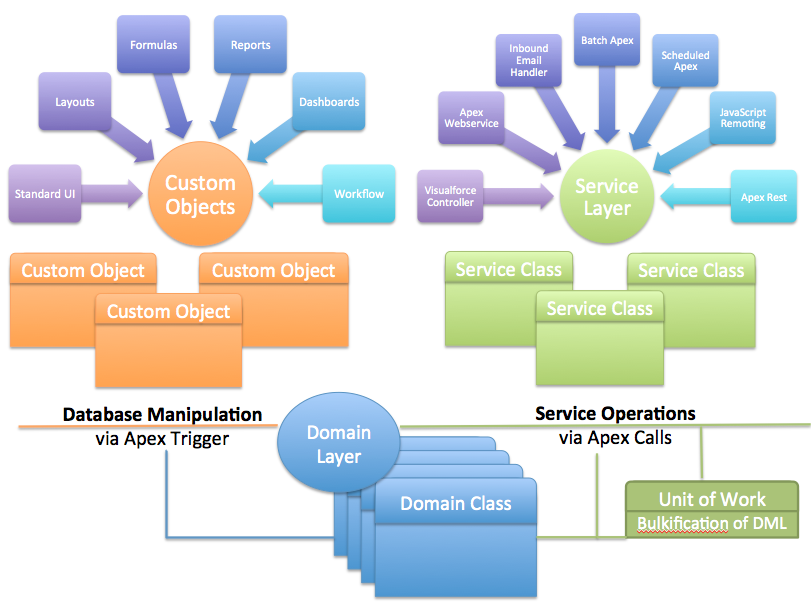

# Domain Pattern

A class responsible for the business logic specific to a single SObject.

- Referred to as “fine grain services”.
- Wrapper around the records you are working with.
  - Think of Triggers
- Initialize the domain class with all of the records of that type that you are working with in the current context.
  - This can be one to many records.
- It does not manage the persistence of records (see UnitOfWork).
- Handles defaulting and validations.
- Once you have the domain class, you work with a single object, executing logic on the records.

Classes to mention in the *fflib-apex-common project*:
- `fflib_SObjectDomain.cls`
- `fflib_ISObjectDomain.cls`

Sample usage:
- `Opportunities.cls`
- `IOpportunities.cls`

### Naming conventions
- Optional "section" prefix which denotes a module/application with underscore.
- Begin with SObject in plural form
  - i.e. `Accounts`, `Services__c`
- Default set of classes (for `FooBar__c` object):
  - `FooBars`
  - `IFooBars`
  - `FooBarsTest`
  - `FooBarsException`

### Minimum setup of a domain class
- Extends `fflib_SObjectDomain`
- Implements the corresponding interface
  - To support mocking
- Implements following methods:
  - Define class constructor tp pass the list of records
  - `public static IOpportunities newInstance(List<Opportunity> recordList)`
    - calls the "Application.Domain.newInstance(recordList)"e
  - `public static IOpportunities newInstance(Set<Id> recordIdSet)`
    - calls the "Application.Domain.newInstance(recordIdSet)"
- Override as needed parent class methods
  - onApplyDefaults()
  - onValidate()
  - onValidate(Map<Id, SObject> existingRecords)
  - onAfterInsert(), onAfterUpdate(), onBeforeInsert(), onBeforeUpdate()
- Add methods that execute some change or logic to records
  - i.e. `applyDiscount(Decimal discountPercentage, fflib_ISObjectUnitOfWork uow)`
    - The records were loaded when the class was instantiated
    - If the method will make changes to records that eventually need to be saved, ass a `uow` parameter.
- Add an inner "Constructor" class
  - Needed for the Apex Common trigger handler logic
    ```java
  	public class Constructor implements fflib_SObjectDomain.IConstructable
	{
		public fflib_SObjectDomain construct(List<SObject> sObjectList)
		{
			return new Opportunities(sObjectList);
		}
	}
    ```
- Trigger Framework hooks
  - Apex Commons Trigegr framework uses the Domain classes as the "Trigger Handler" via the inner Constructor" class
- Trigger setup for each SObject:
  - Setup for all events
  - Call the fflib_SObjectDomain's `triggerHandler` method:
    ```java
    // Opportunities.trigger
    trigger Opportunities on Opportunity (
	after delete, after insert, after update, before delete, before insert, before update) 
    {
        fflib_SObjectDomain.triggerHandler(Opportunities.class);
    }
    ```

<br>



<br>

Notes:
- Domains typically only reference other domains
- Domains sometimes call selector classes for other SObjects
- Domains never call Service tier logic not Client tier logic
- `fflib_SObjectDomain.Test.Database` inner class
  - Serves as a mock database to simulate trigger events without having to save records to the actual database
  - Works nicely with ApexMocks